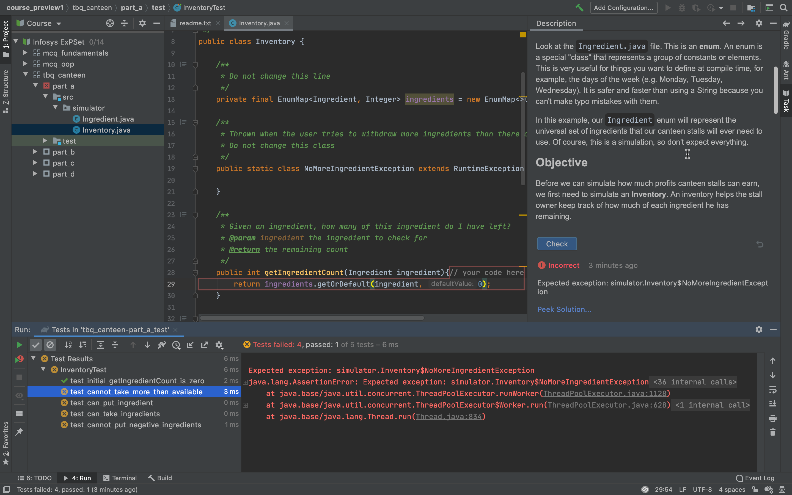
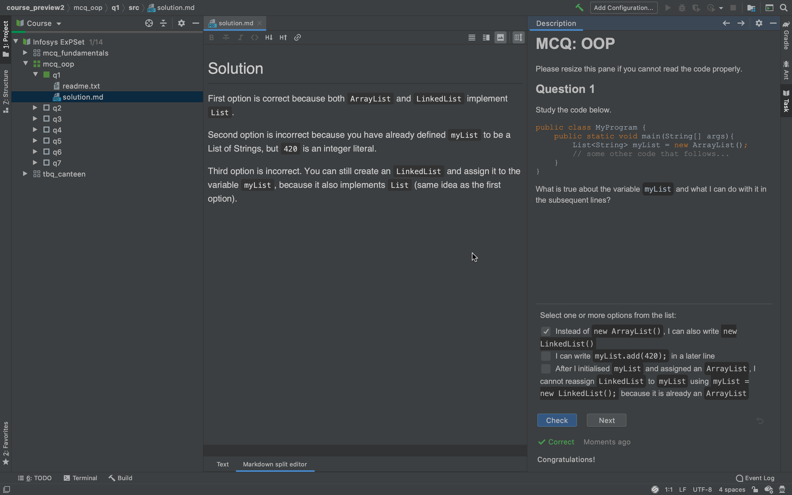

# Infosys Extended Problem Sets (ExPSet)

## Features

- MCQ questions divided into sections
- Theme-Based coding problems with local tests like Vocareum
- Code that you write for the previous parts of a question will automatically be carried over to next parts

This is **an experimental platform**, and we are adding more content as we go. Please raise feedback where needed.

## Downloading and importing

- Install the [EduTools extension](https://www.jetbrains.com/help/education/install-edutools-plugin.html#749c) in your Jetbrains IDE of choice (IntelliJ or Android Studio).
- Go to the `Releases` page of the GitHub repo and download the course archive (a zip file)
- At the welcome splash screen, select "Teach & Learn > Import Local Course", and select the zip file.
- If you already have another project open, click on the `File` tab in the window title bar to find the "Teach & Learn" menu.
- Wait for the Gradle Build/Import to finish (will take several minutes the first time you run it)

## Navigating

When the course has finished loading, you should be able to expand the dropdown menu on the course explorer on the left (where your project files usually go). You can use this to jump between lessons/questions.

After you have selected a specific question, the "Task" window should appear on the right hand side (click on the "Task" ribbon if it doesn't automatically appear).

### MCQ Questions

For some question, there is only one correct answer (radio button), while for other questions there are multiple correct answers (checkbox). If there are multiple correct answers, you must select all correct options for the solution to be considered correct.

Each (most) questions has a `solution.md` file. Try to attempt the question before you open the file.

### Coding Questions

Fill in the "placeholders" (the highlighted rectangles). Code that you type in the placeholders here will be carried over to the next part so you dont have to copy paste.

After you finish coding, press "Check", and click on the "Run" status menu at the bottom to see what tests passed and failed. Double click on the test name to jump to the test code so you can see how your code is being tested.
